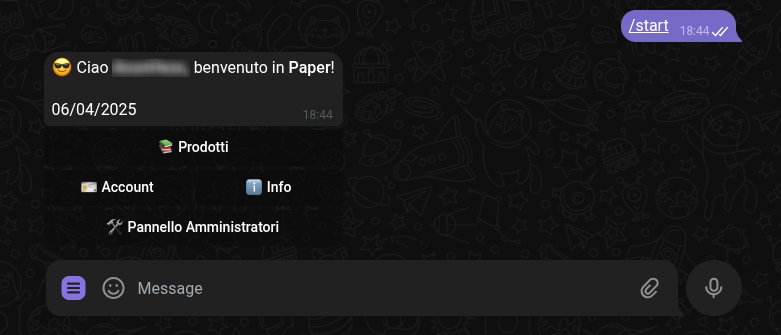
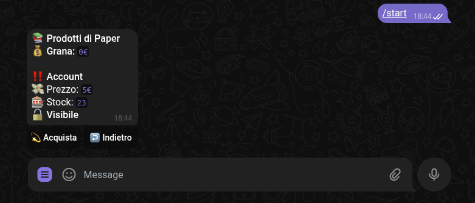
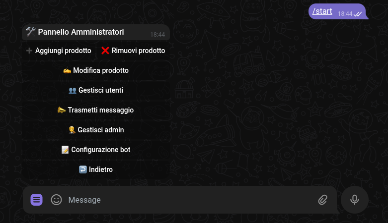

# Paperbot
Semplice shop-bot per Telegram.
- Gestione dinamica prodotti e utenti.
- Completo pannello amministrativo in-line.
- Database MySQL con queries asincrone.

### Pannello principale


### Pannello dei prodotti


### Pannello per amministratori


## Configurazione
1. Clona la repository.
2. Utilizza gli [script](./scripts) per creare un database MySQL.
> [!NOTE]
> Per eseguire gli script: entra su mysql crea un database `CREATE DATABASE mydatabase`,
3. Crea nella root della repo un file `.env` strutturato cosi:
```
TOKEN=<token da BotFather>
DBHOST=<indirizzo database>
DBUSER=<username databse>
DBPWD=<password database>
DBNAME=<nome del database>
```
4. Installa le dipendenze con `npm install`.
5. Esegui l'app con `npm start` o `npm start pretty`.
