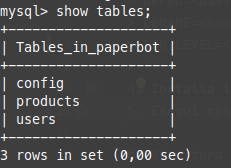
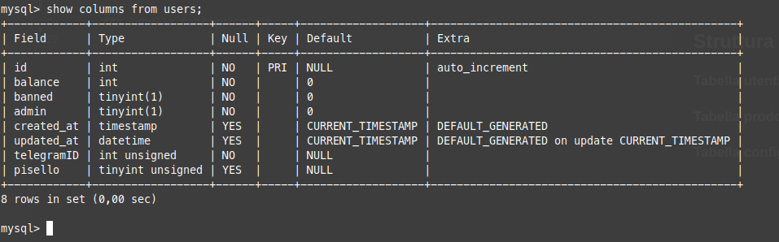
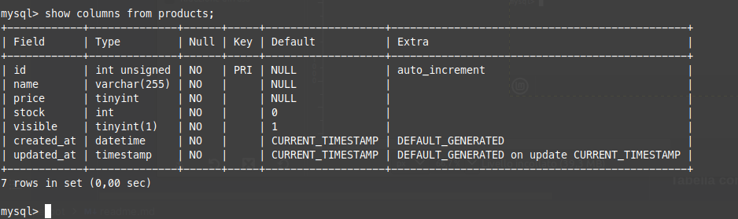
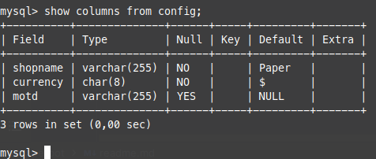

# Shopbot per Telegram
-  Creato con la libreria telegraf.js in node.js
-  Utilizza MySQL per gestire gli utenti e i prodotti
-  Con pannello amministratori per aggiornare il database direttamente dal bot
-  Codice sorgente chiaro e facile da ritoccare
  
## Configurazione
1. Clona la repository localmente
2. Utilizza un database con tabelle `users`, `products` e `config` strutturate come mostrato [qua sotto](#struttura-database)
3. Crea un file `.env` impostato come il seguente:
> ```
> TOKEN=<token del bot>
> DBHOST=<indirizzo del db>
> DBUSER=<username per il db>
> DBPWD=<password per il db>
> DBNAME=<nome del db>
> LOG_LEVEL=<livello di log>
> ```
4. Installa le dipendenze con `npm install`
5. Esegui con `npm start` o `npm start pretty` per log più leggibili

## Struttura database

### Tabella utenti

### Tabella prodotti

### Tabella configurazione
